# Passing in Simulation Is Not Passing: Closed-Loop Testing and the Reality Gap

*Ali Cheraghi · October 6, 2026 · also published at [mindsloop.org](https://mindsloop.org/articles/closed-loop-reality-gap/), with full-quality videos*

A scripted forklift driver passed my simulated closed-loop test 20 times out of 20, which says little about a real warehouse. This post shows how the test closes the loop, where the simulation departs from reality, and how I would measure and shrink that gap.

*Four randomized episodes at 2× speed. Each time: drive 6–8 m to the blue pallet, slide the forks in, lift, hold, lower.*

## The task

A forklift starts 6–8 m from a pallet, drives to it, slides its forks in, lifts the load to the top of the mast, holds it for a second and sets it back down. One run takes about 13 seconds.

Every run is a new scene. The pallet's position and facing change, the forklift starts up to 1.2 m off to the side and up to 15° crooked, and 3 to 12 look-alike pallets are scattered around. Some look-alikes share the target's blue, so only the text instruction says which pallet to take.

The demonstrations come from a scripted driver that steers onto the pallet's center line and never turns tighter than the truck can. It knows exactly where the pallet is; that detail matters later.

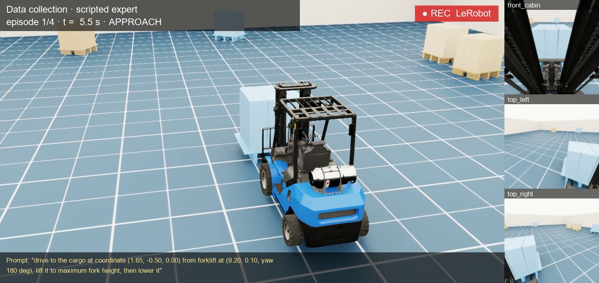

*How each clip is laid out. The large chase view is for people. The three tiles on the right are the only images the policy gets, each 224 × 224, together with the truck's position, speed, fork height and the instruction shown at the bottom.*

Four recorded episodes, each a different random scene:

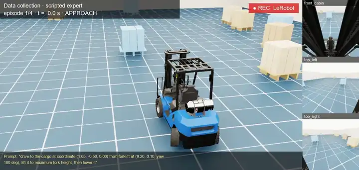

*Episode 1: starts 7.6 m away and almost straight, with 9 look-alike pallets. The forks enter 1 mm off center.*

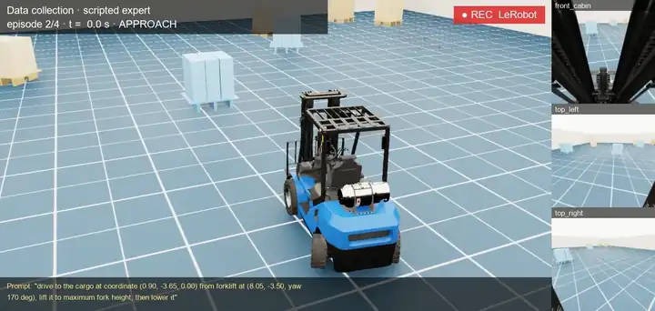

*Episode 2: starts 7.2 m away and 10° crooked, with 7 look-alikes. The driver curves onto the center line before it arrives.*

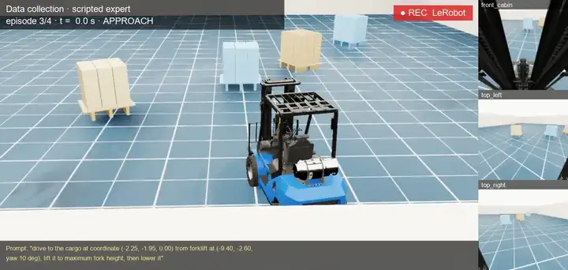

*Episode 3: starts 7.2 m away and 11° crooked, with 4 look-alikes.*

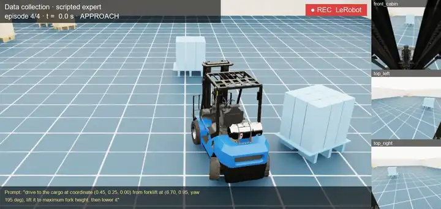

*Episode 4: the shortest run-in, 6.3 m and 13° crooked, with 5 look-alikes. The forks enter 8 mm off center, the largest error of the four.*

## Closed-loop testing

A policy is trained to copy the driver one frame at a time. Testing it the same way, by comparing its action with the driver's on recorded frames, is an open-loop test. It misses the failure that matters: a slightly wrong steering command puts the truck somewhere the recordings never were, and every later frame builds on that error.

A closed-loop test lets the policy drive. Its action moves the truck, the simulator renders what the cameras now see, and the policy answers that new view, 30 times a second, until the run ends.

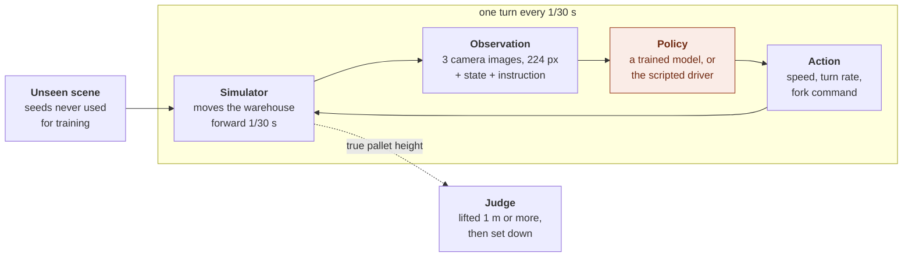

*The loop runs 30 times a second. The judge sits outside it: it reads the simulator's true pallet height, which the policy never sees.*

Three rules keep the test honest:

- **Unseen scenes.** Test layouts come from seeds that never produced training data, so the policy cannot have memorized them.
- **The same inputs as training.** Images get the same resizing as the training data and the instruction uses the same wording, so the test checks driving, not a format mismatch.
- **An outside judge.** A run counts only if the simulator measured the pallet lifted at least 1 m and then set back down, within 30 s.

Three test runs on unseen scenes:

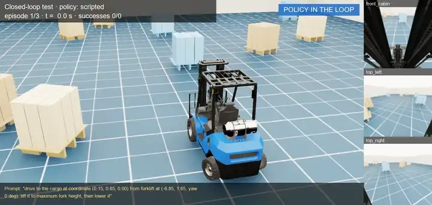

*Test 1: starts 7.0 m away and almost straight, with 11 look-alike pallets. SUCCESS after 12.7 s.*

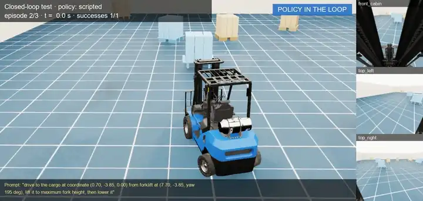

*Test 2: starts 7.0 m away and 13° crooked, with 8 look-alikes. SUCCESS after 12.6 s.*

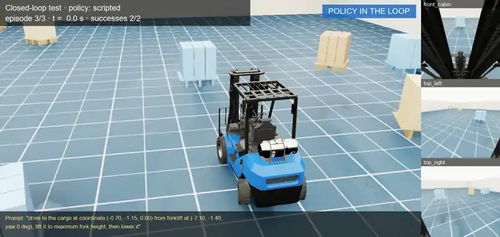

*Test 3: starts 6.4 m away, with 10 look-alikes. SUCCESS after 12.1 s.*

## What 20 out of 20 shows, and what it does not

On 20 more unseen scenes, with 4 to 12 look-alike pallets each, the scripted driver succeeded every time, taking 11.8–13.3 s per run.

That result validates the test, not a robot. It shows the scenes load, the inputs match training, and the judge counts correctly. It does not show that a learned policy would succeed, for two reasons:

- **This driver cheats.** It reads the pallet's exact position from the simulator. A learned policy has to find the pallet in three small camera images, among look-alikes.
- **The simulator is kind.** It leaves out most of what makes a real warehouse hard, as the next section lists.

So 20 out of 20 is the ceiling for this scenario, not a forecast. The 20 test scenes stay fixed, so every future policy is scored on exactly the same runs and the numbers stay comparable.

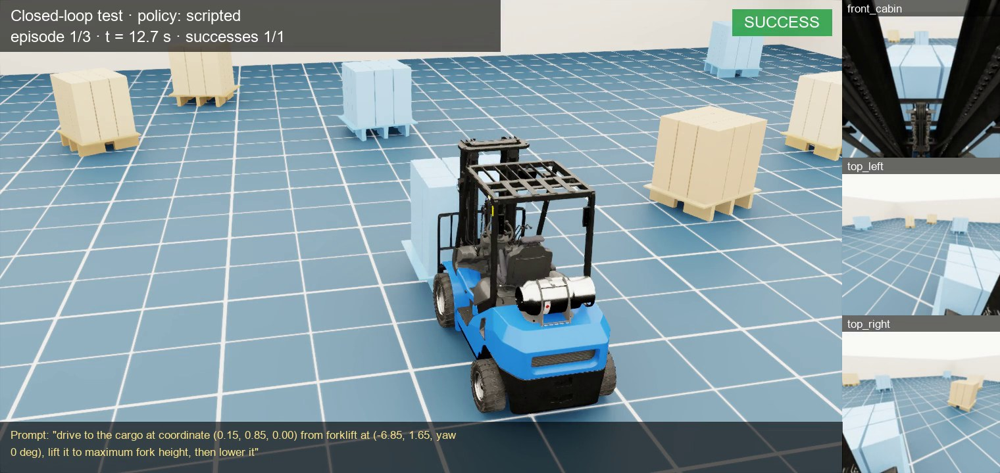

*The last frame of a test run. SUCCESS appears only after the simulator measured the lift and the set-down; the policy has no say in its own score.*

## Where simulation and reality part ways

Each row below is a simplification this simulation makes on purpose, and each is a way a policy could pass here and fail on a real truck.

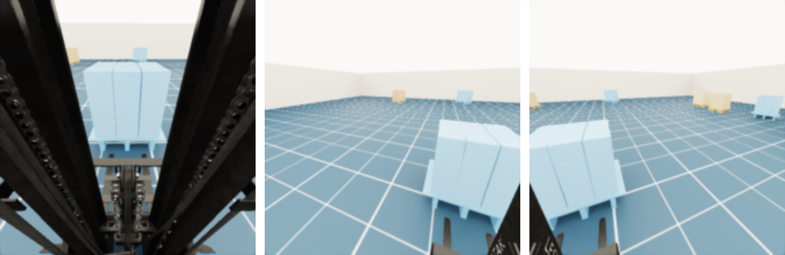

*Everything the policy sees in one frame: three clean, evenly lit renders at 224 × 224. No glare, blur, dirt or people. Real camera images will not look like this.*

| Gap | In this simulation | On a real forklift | How to close it |
| --- | --- | --- | --- |
| **Camera images** | Clean renders, fixed lighting, one pallet model, an empty warehouse | Glare, motion blur, dirty lenses, shrink-wrap reflections, people, racks, broken pallets | Randomize lighting, textures and camera placement; mix real recorded runs into training |
| **Knowing where you are** | The state carries the exact position and heading | Wheel odometry drifts; localization has errors and dropouts | Add noise and drift to the pose in training and tests, or rely on images alone |
| **Driving** | Speed and turn commands take effect instantly, with no wheel slip | Motor lag, rear-wheel steering dynamics, slip, braking that depends on the load | Measure the real truck's response, model it, and randomize it in simulation |
| **Lifting and the load** | The pallet locks to the forks: no friction, sliding or tipping | Lift speed depends on the load; loads shift; a fork can catch the pallet | Add load physics or conservative limits; test lifting on the real truck first |
| **Timing** | The world waits for the policy, 30 times a second | Camera, network and model add delay while the truck keeps moving | Inject delay and dropped frames into simulated tests; measure the real delay |
| **Scene variety** | Only the pallet, the start pose and the look-alike layout change | Racks, aisle widths, other vehicles, floor markings, people walking past | Widen the randomization; rebuild every real failure as a simulated test |
| **Safety** | Nothing can be hurt or damaged; cargo cannot even collide with cargo | People and equipment share the floor; a mistake has real cost | A separate safety system (speed limits, protective sensors, emergency stop) that does not trust the policy |
| **Measuring success** | The judge reads the true pallet height | Success needs sensors or people to measure, and the real job is placing loads precisely without damage | Define the real success rule first, then mirror it in simulation |

The most useful number is the gap itself. Rebuild the 20 test layouts on a marked test floor, run the same policy with the same success rule, and compare real success with simulated success. A large drop says the simulator is missing something important; the failure videos say what.

## When the simulator itself is wrong

Synthetic data deserves the same suspicion as real data. While building this, two of the three cameras silently recorded solid white images because of a rendering setting, and the first frame of every episode still showed the previous scene. A camera check that only looked for black images reported everything as fine.

Both are fixed: the renderer now refreshes after every reset, and the camera check flags blank images as well as black ones. The lesson carries over to any sim-to-real project. A simulator can fail in ways a real camera never does, and a policy trained on those frames learns from them without a single error message.

## From simulation to the warehouse floor

Closing the gap is a sequence, not a switch. Each stage gives the policy a little more freedom, and it must pass before the next one begins.

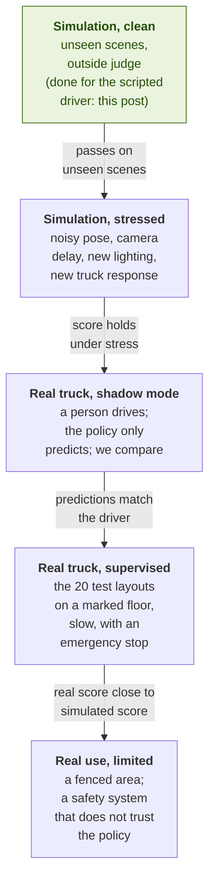

*Each arrow is a gate: the condition on it must hold before the truck gets more freedom.*

Only the first stage is done, and only for the scripted driver. Every later stage reuses the same 20 test layouts and the same success rule, so a drop between stages points straight at the gap that caused it.

---

## About this repository

This repository is a fork of [NVIDIA Isaac Lab](https://github.com/isaac-sim/IsaacLab) with a forklift warehouse task for generating vision-language-action training data in the LeRobot format. Everything in the post above was produced with it.

- [`scripts/forklift/`](scripts/forklift/): the environment, the scripted driver, data collection and the closed-loop test
- [FORKLIFT_TUTORIAL.md](FORKLIFT_TUTORIAL.md): setup and data collection, step by step
- [docs/FORKLIFT_DATASET.md](docs/FORKLIFT_DATASET.md): the dataset format (cameras, state, actions, units)
- [ISAACLAB_README.md](ISAACLAB_README.md): the original Isaac Lab README

Isaac Lab is released under the [BSD-3 License](LICENSE), and its `isaaclab_mimic` extension under [Apache 2.0](LICENSE-mimic). Licenses of dependencies and assets are in [`docs/licenses`](docs/licenses); see [ISAACLAB_README.md](ISAACLAB_README.md#license) for details, including Isaac Sim's own license terms.
